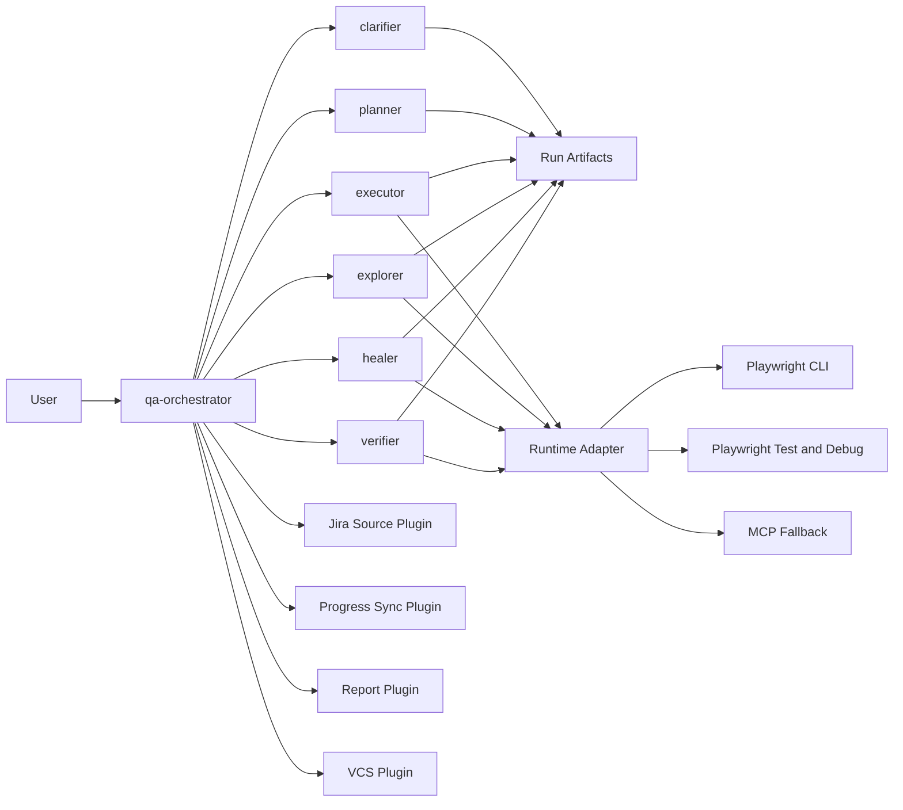
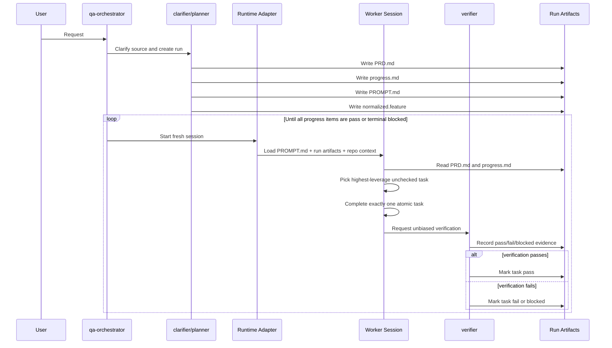

# Copilot-First QA Ralph Harness

Status: In Progress  
Last updated: 2026-04-12

## 1. Summary

This document defines a compact, Copilot-first QA harness for semi-autonomous browser testing. The harness is designed to support six user-facing intents:

- `plan`
- `implement`
- `inspect`
- `execute`
- `heal`
- `coverage`

The harness combines:

- a single user-facing `qa-orchestrator`
- narrowly scoped QA subagents
- Playwright CLI as the primary browser interaction layer
- `playwright-bdd` as the executable feature layer
- a Ralph-style fresh-session loop for iterative execution

The core design goal is leverage without context rot. Each loop iteration must run in a fresh session, operate on one small task, verify the result, and update durable artifacts only after verification.

## 2. Goals

- Create one compact harness that can clarify, plan, execute, inspect, heal, and expand QA coverage.
- Make the executable feature file the source of truth for runtime behavior.
- Minimize improvisation by pushing predictable behavior into reusable skills, step libraries, agents, and templates.
- Keep each task atomic enough that an agent can complete it without drifting or needing a long-lived context.
- Work with Copilot CLI while keeping the runtime adapter replaceable.
- Prefer Playwright CLI first, use Playwright test/debug second, and allow MCP only as recorded fallback.

## 3. Non-Goals

- This design does not attempt to make agents fully creative or open-ended.
- This design does not make Jira tickets directly executable.
- This design does not treat MCP as a default control plane.
- This design does not implement a same-session loop plugin.

## 4. Current Repo Baseline

The design is grounded in the current repository state.

### 4.1 Existing Assets

- Stock Playwright agents already exist in `.github/agents/`:
  - `playwright-test-planner.agent.md`
  - `playwright-test-generator.agent.md`
  - `playwright-test-healer.agent.md`
- The repo already includes `playwright-bdd`.
- The repo already has a basic BDD layout under `Features/` and `Features/steps/`.
- The current step style uses Playwright-style `createBdd(test)` fixtures in `Features/steps/fixtures.ts`.

### 4.2 Current Gaps

- Phase 0 and Phase 1 are complete: the repo now exports nonzero BDD steps, generates specs from real `Features/` and run-backed feature files, and creates/verifies run artifacts through the local `qa-orchestrator`.
- A first Phase 2 slice is complete: `execute-run` now performs verifier preflight, executes generated Playwright specs on Chromium, records runtime proof, and updates run progress automatically.
- A second Phase 2 slice is complete: `iterate-run` now selects one actionable progress item, invokes a fresh child process through a replaceable runtime adapter, records invocation details in `logs/runtime.log`, and updates the selected progress item to `pass`, `fail`, or `blocked`.
- A third Phase 2 slice is complete: `iterate-run` now supports an explicit Playwright CLI -> Playwright test/debug bridge -> MCP runtime order, invokes the configured bridge only when the primary runtime requests it, records MCP fallback reasons in the selected `progress.md` item, and appends structured entries to `logs/fallback.log`.
- A fourth Phase 2 slice is complete: `iterate-run` now applies bounded healing policy directly from the selected `progress.md` item, treats `Retry budget` as remaining healing attempts, decrements it only after a failed attempt actually runs, marks exhausted healing items `blocked`, records a concise block reason, and appends structured entries to `outputs/heal-report.md`.
- A fifth Phase 2 slice is complete: `loop-run` now provides bounded supervisory control above `iterate-run`, reloads run artifacts from disk on every iteration, stops on explicit terminal conditions, and appends structured entries to `outputs/loop-report.md`.
- A first Phase 2.5 slice is complete: `prepare-run` now composes the supported feature-backed clarifier -> planner -> verifier path above the existing run artifacts, keeps `normalized.feature` unchanged, and retains created artifacts when later refinement or verification fails.
- A second Phase 2.5 slice is complete: `advance-run` now provides the first executor/verifier-backed bounded run-advancement path for one selected progress item by delegating execution through `iterate-run`, reviewing the recorded executor outcome, requiring verifier review before reporting `pass`, and emitting concise artifact-backed operator summaries.
- A third Phase 2.5 slice is complete: `prepare-run` now accepts one bounded freeform operator-request intake path through the clarifier, normalizes accepted requests into the current supported feature-backed envelope, preserves the existing clarifier -> planner -> verifier composition, and rejects Jira, non-feature, ambiguous, or otherwise unsupported intake early.
- A fourth Phase 2.5 slice is complete: `prepare-run` now broadens orchestrator -> planner delegation so fresh runs and `prepare-run --run-id <run-id>` both refine `PRD.md`, `progress.md`, and `PROMPT.md` in place, keep `normalized.feature` unchanged, and preserve retained-artifact failure behavior.
- A fifth Phase 2.5 slice is complete: `advance-run` now broadens orchestrator -> healer delegation for healer-scoped selected items by reloading the current run artifacts from disk, delegating exactly one bounded repair attempt through `iterate-run`, preserving the current retry-budget, blocking, fallback, and heal-report semantics, and routing the recorded bounded outcome back through verifier review before reporting.
- A sixth Phase 2.5 slice is complete: operator-facing summaries are now broader and more stable across `prepare-run`, `advance-run`, `iterate-run`, and `loop-run`, while remaining concise, deterministic, artifact-backed, and aligned with the existing stdout/stderr and stop-condition contract.
- A seventh Phase 2.5 slice is complete: healer-owned bounded iterations now append structured `outputs/heal-report.md` entries for pass, fail, and blocked outcomes, record the smallest failing unit, concise root-cause hypothesis, and escalation reason when available, preserve current retry-budget and terminal blocked behavior, and route healer-backed pass/fail/blocked review through the recorded heal report without widening non-healing paths.
- A first Phase 3 slice is complete: `advance-run` now broadens orchestrator -> explorer delegation for explorer-scoped selected items by reloading the current run artifacts from disk, delegating exactly one bounded coverage-discovery attempt through `iterate-run`, preserving the current runtime ordering, fallback, blocking, and concise summary semantics, recording gap candidates in `outputs/gap-analysis.md`, and routing the recorded bounded outcome back through verifier review before reporting.
- A second Phase 3 slice is complete: `prepare-run --run-id <run-id>` now performs bounded planner handoff from recorded explorer gap proposals by reviewing explicit candidates from `outputs/gap-analysis.md`, accepting or rejecting at most one candidate per refinement pass, recording the decision in `outputs/planner-handoff.md`, and translating each accepted candidate into one atomic `progress.md` item without changing the current execution contract.
- A third Phase 3 slice is complete: explorer-owned bounded iterations now append richer structured `outputs/gap-analysis.md` entries for pass, fail, and blocked outcomes, record observed gaps, candidate scenarios or addition targets, supporting evidence, and stop or escalation signals when available, preserve the current planner-handoff boundary and terminal behavior, and keep non-explorer items on their existing narrower execution path.
- A fourth Phase 3 slice is complete: accepted planner-handoff-created executor items now drive one bounded scenario-addition iteration at a time through `advance-run` and `iterate-run`, append structured pass/fail/blocked entries to `outputs/scenario-addition.md`, record the added scenario or outline, target artifact path, supporting evidence, and any stop, block, or escalation reason when available, preserve verifier review as the boundary before `advance-run` reports `pass`, and keep non-handoff executor items on their existing narrower execution path.
- A fifth Phase 3 slice is complete: coverage-scoped `guided-exploratory` runs now carry explicit operator-directed feature, scenario, risk-area, and iteration-budget constraints through the current request envelope and run artifacts, refine `PRD.md`, `progress.md`, and `PROMPT.md` deterministically for guided explorer work, append guided scope and stopping metadata to `logs/runtime.log` and `outputs/gap-analysis.md`, preserve planner review before planner handoff, preserve verifier review before `advance-run` reports `pass`, and keep non-guided runs on their existing narrower paths.
- A sixth Phase 3 slice is complete: coverage-scoped `autonomous-exploratory` runs now choose one deterministic artifact-backed exploration target plus one explicit recorded iteration budget and stop frame through the existing `prepare-run`, `advance-run`, and `iterate-run` surfaces, persist those decisions in `PRD.md`, `progress.md`, `PROMPT.md`, `logs/runtime.log`, and `outputs/gap-analysis.md`, preserve planner review before planner handoff, preserve verifier review before `advance-run` reports `pass`, and keep guided and non-autonomous runs on their existing narrower paths.
- A first Phase 4.5 slice is complete: verifier-backed accepted scenario-addition outcomes now promote at most one bounded scenario or scenario outline from `normalized.feature` into one deterministic canonical `Features/*.feature` target, create or refine minimal reusable step coverage in `Features/steps/` only when needed, append explicit outcomes to `outputs/promotion-report.md`, and fail or block cleanly on target ambiguity, merge conflicts, promotion drift, or unverifiable step coverage while preserving current runtime, verifier, fallback, blocking, retry-budget, loop, and legacy-run semantics.
- A second Phase 4.5 slice is complete: planner-owned run artifacts now rebuild deterministically and resumably from the latest recorded run truth so repeated `prepare-run --run-id <run-id>` refinement, verifier reruns, and bounded advancement do not duplicate planner-owned sections or active-item projections in `PRD.md`, `progress.md`, and `PROMPT.md`, while append-only history remains preserved in `logs/*.log` and structured reports under `outputs/`, planner handoff state remains deduped and resumable across repeated review, canonical promotion behavior remains unchanged, and legacy-run semantics remain intact.
- A third Phase 4.5 slice is complete: operator-facing execution controls now record per-run browser project, headed/debug mode, base URL or target environment, and evidence settings in `PRD.md`, `PROMPT.md`, `logs/runtime.log`, and `logs/verifier.log`, route those controls through the existing `verify-run`, `execute-run`, `advance-run`, `iterate-run`, and `loop-run` surfaces, reuse them deterministically across repeated verifier and executor flows within the same run, keep debug and bridge behavior explicit and artifact-recorded, preserve append-only history in logs and structured reports, and keep canonical promotion behavior unchanged.
- The harness still does not implement the full Ralph loop contract: the current agent migration is still represented as composed harness primitives plus role contract files, there is still no true autonomous runtime delegation or background worker for healer or explorer roles, and healer behavior is still limited to one selected bounded repair item with artifact-backed diagnosis under the current artifact contract.
- Coverage expansion and productization remain partially unimplemented: bounded explorer agent flow, richer gap-analysis artifacts, bounded planner handoff from recorded gap proposals, bounded executor-side scenario addition, the first bounded guided and autonomous exploratory modes, the first canonical promotion path, deterministic resumable planner-owned artifact rewriting, and the first operator-facing execution controls now exist, but supervised burn-in controls, stable resume/pause/abort or inspect-last controls, and operator-visible autonomous stop review are still unimplemented.
- Source intake is still deliberately narrow: the executable slice now supports structured feature-backed requests plus one bounded freeform operator-request path that must normalize to a concrete local feature file, but Jira, run-resume intake, healer intake, explorer intake, and broader freeform normalization remain unimplemented.

### 4.3 Implication

The harness can now prove one real run end-to-end plus planner-backed preparation, narrow freeform clarifier-backed intake normalization, broader planner-backed artifact refinement for fresh and existing runs, bounded planner handoff from recorded explorer gap proposals, bounded executor-side scenario addition from accepted planner handoff items, canonical promotion from accepted run-local additions into repo-local artifacts with bounded step reuse, deterministic resumable planner-owned artifact rewriting for repeated refinement and review, executor/verifier-backed bounded advancement, healer/verifier-backed bounded repair advancement with richer artifact-backed diagnosis, explorer/verifier-backed bounded coverage discovery with richer gap-analysis artifacts, the first bounded guided and autonomous exploratory modes with artifact-backed constraint reuse, broader operator-facing delegated-run summaries, explicit operator-facing execution controls, an explicit browser runtime order, fallback audit trail, bounded healing retries, and bounded loop control. The next work should add supervised burn-in controls, then operator-visible autonomous stop review and broader lifecycle controls.

## 5. Design Principles

### 5.1 Fresh Context Only

The Ralph loop must run as fresh-session iteration, not as a long-lived session. The source of truth is the written artifact set, not accumulated chat history.

### 5.2 Spec Is Memory

`PRD.md`, `progress.md`, `PROMPT.md`, and the normalized feature file are the harness memory. Agents re-read them every iteration.

### 5.3 One Small Task Per Iteration

Every progress item must be small enough to be completed and verified in one iteration. Large, compound tasks are prohibited.

### 5.4 Deterministic Before Adaptive

If a predictable workflow exists, it belongs in:

- a skill
- an agent instruction
- a step library
- a plugin contract
- a template

Improvisation is a last resort, not the default behavior.

### 5.5 CLI-First Tool Policy

Use the simplest primary interface that can do the job:

1. Playwright CLI
2. Playwright test/debug bridge
3. MCP fallback with explicit reason recorded

### 5.6 Human-Readable and Agent-Readable Specs

Feature files, `progress.md`, and `PROMPT.md` must be understandable by:

- humans
- Copilot CLI agents
- future subagents

## 6. System Context



## 7. Repository Layout

The design uses a hidden runtime area so the harness stays compact and does not clutter top-level product code.

```text
.qa-harness/
  runs/
    <run-id>/
      PRD.md
      progress.md
      PROMPT.md
      normalized.feature
      evidence/
        screenshots/
        snapshots/
        traces/
        videos/
      logs/
        runtime.log
        verifier.log
        fallback.log
      outputs/
        gap-analysis.md
        planner-handoff.md
        promotion-report.md
        scenario-addition.md
        heal-report.md
        loop-report.md
```

Static repo assets stay in the existing locations:

- `.github/agents/` for agent definitions
- `.claude/skills/` for predictable workflows
- `Features/` for canonical feature files
- `Features/steps/` for step definitions

## 8. Core Contracts

### 8.1 RequestEnvelope

```ts
type RequestEnvelope = {
  intent: 'plan' | 'implement' | 'inspect' | 'execute' | 'heal' | 'coverage';
  sourceType: 'jira' | 'feature' | 'scenario' | 'run' | 'freeform';
  sourceRef: string;
  mode: 'standard' | 'guided-exploratory' | 'autonomous-exploratory';
  scope: 'single-scenario' | 'single-feature' | 'feature-area' | 'run';
  constraints: string[];
};
```

### 8.2 RunArtifacts

```ts
type RunArtifacts = {
  prdPath: string;               // .qa-harness/runs/<run-id>/PRD.md
  progressPath: string;          // .qa-harness/runs/<run-id>/progress.md
  promptPath: string;            // .qa-harness/runs/<run-id>/PROMPT.md
  normalizedFeaturePath: string; // .qa-harness/runs/<run-id>/normalized.feature
  evidenceDir: string;
  logsDir: string;
  outputsDir: string;
};
```

### 8.3 ProgressItem

```ts
type ProgressItem = {
  id: string;
  goal: string;
  input: string;
  output: string;
  verifyStep: string;
  status: 'todo' | 'doing' | 'pass' | 'fail' | 'blocked';
  retryBudget: number;
  fallbackReason?: string;
};
```

### 8.4 RuntimeAdapter

```ts
type RuntimeAdapter = {
  sessionPolicy: 'fresh-only';
  invoke(args: {
    runId: string;
    runDir: string;
    promptPath: string;
    prdPath: string;
    progressPath: string;
    normalizedFeaturePath: string;
    itemId: string;
    itemGoal: string;
    itemVerify: string;
  }): Promise<{
    status: 'pass' | 'fail' | 'blocked';
    summary: string;
    evidence?: string[];
    runtimeLayer?: 'playwright-cli' | 'playwright-test' | 'mcp';
    requestPlaywrightBridge?: boolean;
    bridgeReason?: string;
    fallbackReason?: string;
  }>;
  captureStdout: true;
  detectCompletion: true;
  carryConversationState: false;
};
```

### 8.5 ToolPolicy

```ts
type ToolPolicy = {
  browserActionOrder: ['playwright-cli', 'playwright-test', 'mcp'];
  recordFallbackReason: true;
  allowMcpOnlyWhenCliMissing: true;
};
```

## 9. Artifact Set

### 9.1 `PRD.md`

`PRD.md` is the stable specification for the current run. It records:

- clarified intent
- source inputs
- scope
- constraints
- success criteria
- out-of-scope conditions
- known ambiguities

### 9.2 `progress.md`

`progress.md` is the Ralph implementation plan:

- small checkbox tasks
- one verifiable outcome per task
- explicit retry budget
- explicit status
- explicit verification step

### 9.3 `PROMPT.md`

`PROMPT.md` is injected every iteration and must tell the runtime to:

1. study `PRD.md`
2. study `progress.md`
3. pick the highest-leverage unchecked task
4. complete exactly one atomic task
5. verify with an unbiased check
6. mark completion only if verification passes
7. record fallback reason if MCP is used

### 9.4 `normalized.feature`

This is the execution truth for the run. If the original request starts from Jira, the clarifier must convert it into a normalized feature file before execution begins.

## 10. Agent Topology

### 10.1 `qa-orchestrator`

Responsibilities:

- classify incoming requests
- choose the correct subagent path
- own run creation and artifact creation
- enforce tool policy
- enforce one-task-at-a-time discipline
- reject unbounded improvisation

The orchestrator is the only user-facing entry point.

### 10.2 `clarifier`

Responsibilities:

- intake from Jira or feature source
- resolve ambiguity
- produce normalized scenario intent
- write missing-question notes into `PRD.md`
- fork workflow:
  - `jira -> normalize to feature`
  - `feature -> validate and normalize`

### 10.3 `planner`

Responsibilities:

- create or refine `PRD.md`
- create atomic `progress.md` tasks
- keep tasks small enough for one iteration
- keep the spec short enough to avoid context rot

### 10.4 `executor`

Responsibilities:

- implement one progress item at a time
- use Playwright CLI first
- run scenario or scenario fragment
- update artifacts only after verifier approval

### 10.5 `explorer`

Responsibilities:

- inspect a chosen feature or scenario
- run bounded exploratory interactions
- analyze pages and results
- identify coverage gaps
- return gap candidates as small progress items

### 10.6 `healer`

Responsibilities:

- run failing scenarios
- diagnose failure cause
- patch the smallest broken unit
- retry within budget
- quarantine only after bounded failure

### 10.7 `verifier`

Responsibilities:

- run an unbiased verification step
- return only:
  - `pass`
  - `fail`
  - `blocked`
- prevent progress from being marked complete before proof exists

### 10.8 Optional Plugins

Allowed plugins:

- `JiraSourcePlugin`
- `ProgressSyncPlugin`
- `ReportPlugin`
- `VcsPlugin`

Rules:

- plugins may extend edges of the harness
- plugins may not own the Ralph loop
- plugins may not replace the source-of-truth artifact set

## 11. Runtime Policy

### 11.1 Primary Runtime Order

1. Playwright CLI for browser actions, snapshots, code generation, and page inspection
2. Playwright test/debug for scenario execution and failure diagnosis
3. MCP only when the CLI lacks the required action

`iterate-run` preserves this order by treating the primary runtime invocation as the Playwright CLI phase. A second bridge invocation is allowed only when the primary runtime explicitly requests it. The bridge is configured through `QA_HARNESS_PLAYWRIGHT_BRIDGE_CMD` and optional `QA_HARNESS_PLAYWRIGHT_BRIDGE_ARGS`.

### 11.2 MCP Fallback Rules

MCP is permitted only when all of the following are true:

- the required action cannot be performed by Playwright CLI
- the action cannot be reasonably re-expressed via Playwright test/debug
- the fallback reason is written into:
  - `progress.md`
  - `logs/fallback.log`

### 11.3 Fresh Session Enforcement

Every Ralph iteration must:

- start a new non-interactive Copilot CLI session
- load only the current artifact set and repo context
- not depend on prior runtime conversation state
- complete or fail independently

Same-session looping is explicitly rejected.

## 12. BDD Model

### 12.1 Canonical Feature Source

Execution truth is the normalized feature file, not the Jira ticket.

If a Jira ticket is the starting source:

1. ingest ticket
2. clarify missing intent
3. normalize into feature scenarios
4. use the normalized feature as the executable truth

### 12.2 Step Discovery Rule

The harness must prefer exported step definitions over invented step wording.

Rule:

1. run `bddgen export`
2. if a matching pattern exists, use it exactly
3. only propose new step text when no matching pattern exists

### 12.3 Existing Project Step Style

New step implementations must follow the current local style:

- Playwright-style fixtures
- `createBdd(test)`
- function-based step definitions under `Features/steps/`

This matches the existing `Features/steps/fixtures.ts` and `Features/steps/index.ts`.

### 12.4 Canonical Feature Format

The harness uses simple, CLI-shaped Gherkin. Step wording must stay narrow and operational.

Allowed top-level structure:

- tags
- `Feature`
- optional `Background`
- `Scenario` or `Scenario Outline`
- `Examples`

Allowed tagging baseline:

- `@jira:<ticket>`
- `@plan`
- `@coverage`
- `@heal`
- `@exploratory`
- `@smoke`
- `@regression`

### 12.5 Initial Step Catalog

The bootstrap phase should define a small, canonical step library that mirrors Playwright CLI verb families.

| Category | Example step | Primary mapping |
| --- | --- | --- |
| Session | `Given the browser session is open` | `playwright-cli open` |
| Navigation | `Given I open {string}` | `playwright-cli open/goto` |
| Snapshot | `When I capture a snapshot` | `playwright-cli snapshot` |
| Click | `When I click {string}` | `playwright-cli click` |
| Fill | `When I fill {string} with {string}` | `playwright-cli fill` |
| Type | `When I type {string}` | `playwright-cli type` |
| Press | `When I press {string}` | `playwright-cli press` |
| Select | `When I select {string} from {string}` | `playwright-cli select` |
| Check | `When I check {string}` | `playwright-cli check` |
| Hover | `When I hover {string}` | `playwright-cli hover` |
| Upload | `When I upload {string}` | `playwright-cli upload` |
| Eval | `When I evaluate {string}` | `playwright-cli eval` |
| Title assert | `Then the title should contain {string}` | title assertion |
| URL assert | `Then the url should contain {string}` | URL assertion |
| Visibility assert | `Then I should see {string}` | visibility assertion |
| Value assert | `Then {string} should have value {string}` | value assertion |

Rules:

- use narrow verbs
- do not use prose-heavy narrative steps
- keep steps close to the action model the runtime actually supports

### 12.6 Normalized Feature Example

```gherkin
@jira:QA-123 @coverage
Feature: Checkout form validation

  Background:
    Given the browser session is open
    And I open "/checkout"

  Scenario: Missing card number
    When I click "getByRole('button', { name: 'Pay now' })"
    Then I should see "Card number is required"
```

## 13. Request Flows

### 13.1 Jira -> New Scenario

User request:

> Please refer to this Jira ticket and create a new scenario.

Flow:

1. orchestrator creates run
2. clarifier ingests Jira
3. clarifier normalizes Jira intent into feature language
4. planner writes `PRD.md`
5. planner writes atomic `progress.md`
6. executor adds one scenario or scenario outline at a time
7. verifier confirms syntax, step coverage, and execution outcome

### 13.2 Feature -> Increase Coverage

User request:

> Please refer to this Feature file scenario and increase coverage.

Flow:

1. orchestrator loads feature source
2. clarifier validates scenario scope
3. planner decides guided or autonomous exploratory mode
4. explorer runs the existing scenario
5. explorer inspects snapshots/pages/results
6. explorer writes gap proposals
7. planner turns gaps into atomic progress items
8. executor automates one addition at a time
9. verifier checks each added scenario

### 13.3 Self-Heal Legacy Scenarios

User request:

> Fix old scenarios.

Flow:

1. orchestrator creates heal run
2. healer executes failing scenario set
3. healer diagnoses smallest failing unit
4. executor or healer patches only the target area
5. verifier reruns the targeted proof
6. progress updates only on verified pass
7. if retry budget expires, mark `blocked` or quarantine with reason

## 14. Ralph Loop Contract



Iteration rules:

- exactly one atomic task per iteration
- verification is mandatory
- progress is updated only by verified outcome
- no session reuse

## 15. Progress Granularity Rules

Every `progress.md` item must satisfy all of the following:

- one goal
- one input source
- one output artifact
- one verification step
- one owner agent
- explicit retry budget
- explicit done condition

Disallowed examples:

- "increase checkout coverage"
- "heal all payment scenarios"
- "inspect app and fix tests"

Allowed examples:

- "normalize Jira QA-123 into one checkout feature scenario"
- "add one missing validation scenario for empty card number"
- "replace one broken locator in checkout payment scenario"

## 16. Verification Rules

### 16.1 Verifier Output Contract

The verifier returns only:

- `pass`
- `fail`
- `blocked`

### 16.2 Proof Before Progress

No task may transition to `pass` unless the verification step succeeded.

### 16.3 Evidence Capture

The verifier should attach the smallest sufficient proof:

- scenario output
- CLI snapshot
- Playwright test output
- trace or screenshot if necessary

## 17. Healing Policy

### 17.1 Retry Budget

Default retry budget per healing item:

- `2` targeted patch attempts
- `1` final diagnostic retry

Current executable slice:

- `iterate-run` reads the selected item's `Retry budget` field as the remaining bounded healing budget
- the budget is decremented only when a healing attempt fails after the runtime actually ran
- passing healing iterations do not change the budget
- non-healing items keep the previous `iterate-run` behavior

### 17.2 Quarantine Rule

If a scenario still fails after the retry budget:

- mark task `blocked`
- record the concise block reason directly in the selected progress item
- append a structured entry to `outputs/heal-report.md`
- optionally quarantine the scenario in a later slice
- record root-cause hypothesis
- record why safe automatic repair was not possible

### 17.3 Fallback-to-Human Conditions

Escalate when:

- the failure depends on unclear business intent
- the page behavior conflicts with the spec
- the fix would require broad refactor outside the task boundary
- the agent would need to invent behavior not grounded in artifacts

## 18. Plugin Boundaries

Plugins may extend integration points but must stay outside the execution core.

| Plugin | Allowed scope | Not allowed |
| --- | --- | --- |
| `JiraSourcePlugin` | fetch and normalize Jira source metadata | direct execution without feature normalization |
| `ProgressSyncPlugin` | sync `progress.md` to external systems | own task selection logic |
| `ReportPlugin` | publish summaries and evidence | modify pass/fail outcomes |
| `VcsPlugin` | optional commit or PR automation | run the Ralph loop |

`progress.md` sync is a good plugin candidate because it is a predictable artifact export, not core execution logic.

## 19. Existing Agent Migration

The harness should migrate existing stock agents instead of replacing them with an unrelated fleet.

| Current agent | Target role | Migration rule |
| --- | --- | --- |
| `playwright-test-planner` | `qa-planner` | keep planning role, make it CLI-first and artifact-aware |
| `playwright-test-generator` | `qa-executor` | keep generation/execution role, route browser actions through Playwright CLI first |
| `playwright-test-healer` | `qa-healer` | keep healing role, use CLI and test-debug bridge before MCP |

Add new roles:

- `qa-orchestrator`
- `qa-clarifier`
- `qa-explorer`
- `qa-verifier`

### 19.1 Intended Agent-Backed Flow

The intended operator experience is agent-first, not raw-CLI-first.

The user should talk to `qa-orchestrator` in natural language. The orchestrator then selects the correct role path, runs the bounded harness command sequence underneath, and returns concise operator-facing updates plus artifact references.

The intended role flows are:

1. Create or refine a run
   - `qa-orchestrator` receives the request
   - `qa-clarifier` resolves ambiguity and normalizes intent
   - `qa-planner` writes or refines `PRD.md`, `progress.md`, and `PROMPT.md`
   - `qa-verifier` confirms the artifact set is executable
2. Execute one planned step
   - `qa-orchestrator` selects the run and bounded objective
   - `qa-executor` performs exactly one atomic progress item
   - `qa-verifier` records the proof-backed outcome
   - `qa-orchestrator` summarizes status back to the operator
3. Heal one failing area
   - `qa-orchestrator` reloads the current run and selects one healer-scoped progress item through `advance-run`
   - `qa-healer` diagnoses the smallest failing unit and performs one bounded repair attempt through the current artifact contract
   - `qa-verifier` reviews the targeted recorded proof and records the result
   - `qa-orchestrator` stops on pass, fail, blocked, or exhausted budget and reports the outcome
4. Expand coverage
   - `qa-orchestrator` starts a coverage-scoped run
   - `qa-explorer` performs bounded exploration and identifies gap candidates
   - `qa-planner` converts accepted gaps into atomic `progress.md` items
   - `qa-executor` adds one scenario at a time
   - `qa-verifier` confirms syntax, step coverage, and runtime proof

The orchestrator should delegate sequentially and explicitly:

- one bounded sub-agent role at a time
- one atomic progress item at a time
- one fresh session per iteration
- no hidden same-session state
- no autonomous background worker outside the run artifact contract

### 19.2 Agent Migration Small Tasks

The intended flow above should be implemented as small supervised slices:

- [x] add a first bounded orchestrator-backed preparation slice through clarifier -> planner -> verifier
  - keep the supported path feature-backed and artifact-first
  - refine only the just-created `PRD.md`, `progress.md`, and `PROMPT.md`
  - keep `normalized.feature` unchanged in this slice
  - preserve retained-artifact behavior on downstream planner or verifier failure
- [x] add a first bounded orchestrator-backed advancement slice through executor -> verifier
  - keep `advance-run` as the additive operator-facing command surface
  - keep `iterate-run` as the bounded execution primitive beneath `advance-run`
  - require verifier review before `advance-run` reports `pass`
  - keep executor and verifier summaries concise, deterministic, and artifact-backed
- [x] broaden orchestrator-to-clarifier delegation for request intake and normalization
  - keep `prepare-run` as the additive operator-facing command surface for this slice
  - add one bounded freeform operator-request intake path that normalizes into the existing supported feature-backed request envelope
  - require a concrete local feature path or recognizable `Features/...*.feature` reference and default missing supported fields conservatively
  - reject Jira, non-feature, ambiguous, or otherwise unsupported freeform intake cleanly instead of inventing a second execution format
- [x] broaden orchestrator-to-planner delegation for `PRD.md`, `progress.md`, and `PROMPT.md`
  - make the planner artifact-aware so it reads and updates the current run directory instead of generating detached prose
  - enforce one-goal, one-input, one-output, one-verify-step progress items
  - keep task size small enough for one bounded iteration and short enough to avoid context rot
  - preserve existing artifact layout and legacy-run compatibility
- [x] add orchestrator-to-healer delegation for bounded repair runs
  - determine healer scope from the current run artifacts and the existing healing classification behavior
  - preserve the current retry-budget, blocking, fallback, and heal-report semantics already implemented in `iterate-run`
  - keep healer patches bounded to the selected area instead of allowing broad speculative cleanup
  - ensure targeted reruns flow back through verifier-owned evidence and the existing run artifacts
- [x] broaden operator-facing summary messages around delegated runs and stop conditions
  - report run creation, iteration progress, stop reason, and final status in concise operator language
  - reference artifact paths for follow-up instead of duplicating long logs in chat
  - distinguish success, blocked, fail, and budget-exhausted outcomes explicitly
  - keep user-facing summaries stable whether the underlying worker is planner, executor, healer, or explorer
- [x] add orchestrator-to-explorer delegation for coverage discovery runs
  - keep exploration bounded by feature or scenario scope
  - route exploration through the same fresh-session rules as execution and healing
  - require explorer output to be gap candidates, not direct large scenario batches
- [x] keep planner handoff from accepted gap proposals as the next bounded slice
  - translate accepted explorer findings from `outputs/gap-analysis.md` into one-item `progress.md` entries
  - require each proposed gap to name one scenario-sized change and one proof step
  - reject vague gap proposals such as “increase checkout coverage”
  - keep planner review as the boundary between exploration and execution
- keep each delegated slice executable through the existing local harness commands
  - avoid inventing a second orchestration core alongside `create-run`, `verify-run`, `execute-run`, `iterate-run`, and `loop-run`
  - treat the current harness commands as the execution primitive beneath agent delegation
  - extend behavior additively so legacy CLI-driven runs still work
- preserve fresh-session iteration and artifact-first state as the source of truth
  - require every delegated worker step to reload run artifacts from disk
  - prohibit same-session hidden memory from becoming execution truth
  - keep the written run directory as the durable contract for resumability, audit, and debugging

## 20. Phased Delivery

### Phase 0: Bootstrap BDD Baseline

Status: Complete

Small tasks:

- [x] align `defineBddConfig()` to real `Features/` and `Features/steps/`
- [x] get `bddgen export` to return nonzero steps
- [x] define initial canonical step library
- [x] confirm feature generation path

### Phase 1: Single-Run Harness Core

Status: Complete

Small tasks:

- [x] add run directory creation
- [x] add `PRD.md`, `progress.md`, `PROMPT.md`, and normalized feature generation
- [x] add request classification
- [x] add one-task progress discipline
- [x] add verifier gate

### Phase 2: CLI-First Execution and Healing

Status: Complete

Small tasks:

- [x] add runtime adapter
- [x] add one bounded `iterate-run` fresh-session iteration
- [x] add CLI-first executor behavior
- [x] add Playwright test/debug bridge
- [x] add MCP fallback logging
- [x] add healer retry budget and block conditions
- [x] add bounded `loop-run` supervision above `iterate-run`

### Phase 2.5: Agent-Backed Orchestration

Status: Complete

Small tasks:

- [x] add a first bounded feature-backed `prepare-run` role-migration slice
  - compose the current clarifier -> planner -> verifier path above the existing run artifacts
  - keep planner output executable by the current harness instead of free-form documentation
  - keep `normalized.feature` unchanged in this slice
  - retain created artifacts when later planner or verifier stages fail
- [x] add a first bounded one-item `advance-run` role-migration slice
  - keep `advance-run` as the additive operator-facing command surface
  - delegate execution through the existing `iterate-run` primitive for exactly one selected progress item
  - require verifier review after the executor-recorded outcome and before reporting `pass`
  - keep executor and verifier summaries concise, deterministic, and artifact-backed
- [x] broaden orchestrator -> clarifier delegation for request intake and normalization
  - keep `prepare-run` as the additive operator-facing command surface
  - accept one bounded freeform operator-request path only when it can normalize to the current supported feature-backed envelope
  - write clarification and normalization output into run artifacts instead of keeping it only in conversation
  - make unsupported Jira, non-feature, ambiguous, or otherwise unsupported inputs fail early with explicit reasons
- [x] broaden orchestrator -> planner delegation for artifact authoring and refinement
  - wire the planner to create or refine `PRD.md`, `progress.md`, and `PROMPT.md`
  - keep planner output executable by the existing harness instead of free-form documentation
  - enforce atomic progress discipline when planner rewrites or appends work items
  - support resuming an existing run and refining the plan without resetting unrelated artifacts
- [x] add orchestrator -> healer delegation for bounded healing runs
  - route healer-scoped selected items into the current bounded retry model instead of introducing autonomous repair
  - keep healer iterations scoped to one failing item with explicit stop criteria
  - capture bounded diagnosis and escalation information through the current run artifacts without weakening current safety rules
  - ensure blocked healing outcomes remain visible to the operator and resumable later
- [x] broaden operator-facing summaries around delegated execution and stop conditions
  - standardize start, progress, and completion messages from the user-facing orchestrator
  - include run id, current item, iteration budget, stop reason, and artifact references when relevant
  - keep success on stdout-style summaries and terminal non-pass outcomes clearly distinguished
  - avoid leaking internal agent prompts when a concise outcome summary is sufficient

### Phase 3: Coverage Expansion

Small tasks:

- [x] add orchestrator -> explorer delegation for bounded coverage discovery
  - add a coverage-scoped dispatch path from the orchestrator into an explorer worker
  - bound exploration by selected feature, scenario, or feature area instead of open-ended browsing
  - preserve the same fresh-session and runtime-policy rules used elsewhere in the harness
  - return gap candidates through artifacts rather than ad hoc chat-only notes
- [x] add planner handoff from explorer gap proposals into atomic progress items
  - translate accepted explorer findings into one-item `progress.md` entries
  - require each proposed gap to name one scenario-sized change and one proof step
  - reject vague gap proposals such as “increase checkout coverage”
  - keep planner review as the boundary between exploration and execution
- [x] add explorer agent
  - define the explorer role contract in `.github/agents/`
  - make the explorer artifact-aware and bounded by feature scope
  - require explorer output to emphasize observed gaps, evidence, and candidate scenarios
  - keep direct scenario mutation out of the explorer role
- [x] add guided exploratory mode
  - support operator-directed exploration where scope and stopping conditions are explicit
  - allow the operator to constrain features, scenarios, risk areas, and iteration budget
  - capture guided findings in a structured artifact form that the planner can reuse
  - make guided mode the safer first coverage-expansion path
- [x] add autonomous exploratory mode
  - allow the planner or orchestrator to choose bounded exploration automatically when the artifact set justifies it
  - keep autonomy narrow: explicit budgets, explicit scope, and explicit stop reasons
  - preserve sandbox defaults and prohibit open-ended crawling
  - require autonomous findings to flow back through planner review before any scenario creation
- [x] add gap analysis artifact
  - define `outputs/gap-analysis.md` as the durable coverage-discovery summary
  - append structured gap-analysis entries with feature scope, observed gaps, candidate scenarios or addition targets, evidence references, and stop or escalation signals
  - keep the artifact backward-compatible for runs that predate coverage expansion
  - make the artifact readable by both operators and future worker sessions
- [x] add first bounded scenario-addition workflow
  - keep `advance-run` as the additive operator-facing command surface
  - keep `iterate-run` as the bounded execution primitive beneath `advance-run`
  - let the executor add one scenario or scenario outline at a time only from accepted planner handoff items
  - ground each addition in the accepted planner item plus `normalized.feature`, not free-form test invention or chat-only proposals
  - require verifier checks for syntax, step coverage, and runtime proof after each addition
  - stop additions when proof fails, blocking conditions are hit, or the bounded budget is exhausted without widening healer, explorer, or loop semantics

### Phase 4: Plugin Edges and Hardening

Small tasks:

- add Jira source plugin
  - fetch and normalize Jira ticket metadata into feature-ready inputs
  - keep Jira ingestion outside the execution core and require normalization before execution begins
  - record enough ticket provenance in run artifacts for audit and replay
  - fail cleanly when Jira input is incomplete or conflicts with the normalized feature truth
- add progress sync plugin
  - export `progress.md` state and run status to external systems without moving task-selection authority out of the harness
  - keep sync one-way from artifact truth to external observers
  - include links or references to the relevant run artifacts
  - make sync resilient to partial runs and legacy artifacts
- add report plugin
  - publish concise run summaries assembled from verifier, runtime, fallback, heal, loop, and future gap-analysis artifacts
  - keep report generation additive and read-only with respect to pass/fail outcomes
  - support operator-friendly summary views without replacing raw artifact inspection
  - ensure reports remain useful even when some optional artifacts are absent on older runs
- add optional VCS plugin
  - support bounded commit or PR creation only after verified outcomes
  - keep VCS automation optional and outside the execution loop
  - scope VCS actions to the current run’s intended changeset
  - prohibit the plugin from owning task selection or loop continuation
- add supervised burn-in and operator controls
  - add explicit operator-visible controls for iteration budgets, resume, abort, and stop-reason review
  - keep new runs supervised until the delegated flow proves stable in practice
  - surface control points where the operator can inspect artifacts before another iteration begins
  - preserve sandbox defaults and require deliberate escalation for riskier operations

### Phase 4.5: Real Runtime Productization

This phase is the productization bridge between the current artifact-backed POC harness and a real operator-usable product. These slices should land before broader source-intake or plugin ambition if the goal is to replace demo-only runtime paths with a supported execution path.

Small tasks:

- [x] add canonical promotion from run artifacts into repo artifacts
  - allow verifier-backed accepted scenario additions to promote from `normalized.feature` into the canonical `Features/` feature file instead of stopping at run-local artifacts
  - allow bounded step-definition creation or refinement in `Features/steps/` when the existing reusable step library is insufficient
  - add an explicit promotion report or equivalent artifact so operators can see what moved from run-local artifacts into canonical repo artifacts
  - fail cleanly on target ambiguity, merge conflicts, or unverifiable step coverage instead of silently leaving run-local and canonical artifacts out of sync
- [x] make planner refinement and run artifacts idempotent
  - prevent repeated `prepare-run --run-id <run-id>` passes from duplicating `progress.md` items, guided or autonomous metadata sections, verifier rows, or planner-handoff-derived work items
  - rebuild canonical artifact sections deterministically from the latest artifact truth instead of appending noisy duplicate blocks on refinement
  - preserve append-only history in `logs/*.log` and structured reports under `outputs/` while deduping planner-owned sections and active projections
  - keep reruns, resume, and repeated verification behavior predictable for operators and future worker sessions
  - preserve legacy run compatibility while tightening deterministic artifact rewriting
- [x] add first operator-facing execution controls required for real use
  - support headed or debug execution through the orchestrator or bridge surfaces without bypassing verifier, runtime, or fallback artifact recording
  - allow operators to choose browser project, base URL or environment target, and evidence settings such as traces, video, and screenshots per run
  - keep operator summaries concise while making visual browser debugging a first-class supported path
  - keep stable resume, pause, abort, inspect-last-artifact, and inspect-last-stop-reason controls out of this slice
- harden runtime portability and release readiness
  - eliminate shell-specific process-launch assumptions across Windows, macOS, and Linux, including `npx.cmd`, PowerShell policy, and child-process invocation edge cases
  - add preflight checks for installed browsers, configured runtime commands, configured bridge commands, required environment variables, and reachable target environments
  - add integration coverage around the real external worker path, not only unit coverage around harness composition
  - document one supported local install-and-run path and one supported CI path for the harness
- only after these slices are stable, resume broader intake and plugin expansion
  - keep Jira-backed normalization, progress sync, reporting, and optional VCS automation additive and outside the execution core
  - avoid widening intake or edge automation before the real runtime worker and canonical promotion path are trustworthy
  - treat broader product integration as downstream of a stable real execution path, not as a substitute for it

## 21. Operational Controls

### 21.1 Supervised Burn-In

New runs should start supervised:

- watch first iterations
- fix spec if drift appears
- restart loop only after artifact correction

### 21.2 Stop Criteria

Stop the loop when:

- all tasks are `pass`
- a terminal `blocked` item is hit
- verification repeatedly fails for the same atomic item
- the spec is proven wrong

### 21.3 Spec Size Limit

Keep `PRD.md` and `progress.md` short enough that each session stays far below the context rot zone described in `ralph-loop.md`.

### 21.4 Sandbox Requirement

Exploratory and brute-force testing should default to sandboxed environments. The harness is intended to find defects, not to act against production systems.

## 22. Acceptance Test Plan

- Prove a Jira-only request becomes a normalized feature file before any execution begins.
- Prove a feature-only request can increase coverage in guided and autonomous exploratory modes.
- Prove every Ralph iteration is a fresh runtime session.
- Prove the executor prefers Playwright CLI, invokes the Playwright test/debug bridge only when requested, and records a reason when MCP is used.
- Prove `progress.md` is updated only after verifier returns `pass`.
- Prove healing runs one failing scenario at a time and stops after bounded retries.
- Prove the BDD bootstrap phase removes the placeholder `defineBddConfig()` shape and produces nonzero `bddgen export` output.

## 23. Decisions Locked By This Document

- One user-facing orchestrator
- Fresh-session Ralph loop only
- Normalized feature file as execution truth
- `PRD.md` + `progress.md` + `PROMPT.md` as canonical artifact set
- Playwright CLI first, then Playwright test/debug, then MCP fallback
- Strict, narrow step library
- Small-task discipline as a hard rule, not a suggestion
- Plugins only at the edges

## 24. Completed Recently

1. Fixed `defineBddConfig()` to use the real `Features/` and `Features/steps/` layout plus run-backed feature files.
2. Made `bddgen export` return the local step definitions and generate runnable Playwright specs.
3. Added the run artifact templates and the local `qa-orchestrator` create/verify flow.
4. Implemented `qa-orchestrator` and `qa-verifier` as the enforcing edge of the harness contract.
5. Added `execute-run` so a fresh feature-backed run can verify, execute on Chromium, log runtime proof, and auto-update `progress.md`.
6. Added the fresh-session runtime adapter abstraction plus one bounded `iterate-run` command that selects one progress item, invokes a fresh child process with explicit artifact paths, logs the invocation, and writes back `pass`/`fail`/`blocked`.
7. Added unit coverage for `iterate-run` CLI parsing, next-item selection, fresh-process invocation, pass/fail/blocked transitions, and legacy run compatibility.
8. Added the Playwright test/debug bridge layer plus structured MCP fallback logging so `iterate-run` can request a second-stage bridge explicitly, keep `progress.md` fallback reasons clean, and append audited fallback entries to `logs/fallback.log`.
9. Added bounded healing retry execution so `iterate-run` consumes `Retry budget` only on failed healing attempts, marks exhausted healing items `blocked`, records block reasons in run artifacts, and appends structured entries to `outputs/heal-report.md`.
10. Added bounded `loop-run` supervision above `iterate-run` so multiple fresh iterations can execute without session reuse, stop on explicit terminal conditions, and record `outputs/loop-report.md`.
11. Added planner-backed artifact authoring and refinement inside `prepare-run` so the current feature-backed preparation path now composes clarifier -> planner -> verifier while keeping `normalized.feature` unchanged and retaining created artifacts on downstream failure.
12. Added the first executor/verifier-backed bounded `advance-run` path so one selected progress item now executes through `iterate-run`, records an executor outcome, requires verifier review before `pass`, and reports concise artifact-backed executor and verifier summaries.
13. Added a bounded freeform clarifier-backed `prepare-run` intake path so operator requests that explicitly reference a local feature file can normalize into the current supported feature-backed envelope, preserve the existing planner/verifier preparation path, and fail early on Jira, non-feature, or ambiguous input.
14. Added bounded orchestrator -> healer delegation inside `advance-run` so healer-scoped selected items now reload current run artifacts from disk, execute exactly one bounded repair attempt through `iterate-run`, preserve current retry-budget, blocking, fallback, and heal-report semantics, and route the recorded bounded outcome back through verifier review before reporting.
15. Broadened operator-facing summaries across `prepare-run`, `advance-run`, `iterate-run`, and `loop-run` so delegated paths now report stable outcome language, selected item and stop details when available, and concise artifact references without changing the underlying artifact contract or execution semantics.
16. Added bounded orchestrator -> explorer delegation inside `advance-run` so explorer-scoped selected items now reload current run artifacts from disk, execute exactly one bounded coverage-discovery attempt through `iterate-run`, preserve current runtime ordering, fallback, blocking, and concise summary semantics, record gap candidates in `outputs/gap-analysis.md`, and route the recorded bounded outcome back through verifier review before reporting.
17. Added bounded planner handoff during `prepare-run --run-id <run-id>` so existing runs now review one recorded explorer gap candidate at a time from `outputs/gap-analysis.md`, record accepted or rejected planner decisions in `outputs/planner-handoff.md`, and translate each accepted candidate into one atomic `progress.md` item without changing the current execution, verifier, healer, explorer, or loop contract.
18. Added richer healer diagnosis and escalation recording so healer-owned bounded iterations now append structured pass/fail/blocked entries to `outputs/heal-report.md`, record the smallest failing unit, concise root-cause hypothesis, and escalation reason when available, and let `advance-run` read healer-backed summaries from that artifact while preserving retry-budget, blocking, verifier, and legacy-run behavior.
19. Added richer explorer gap-analysis and scenario-addition candidate recording so explorer-owned bounded iterations now append structured pass/fail/blocked entries to `outputs/gap-analysis.md`, record observed gaps, candidate scenarios or addition targets, supporting evidence, and stop or escalation signals when available, preserve planner handoff as the boundary before any future scenario addition, and keep current CLI, verifier, fallback, blocking, loop, and legacy-run behavior unchanged.
20. Added the first bounded scenario-addition slice from accepted planner handoff items so `advance-run` and `iterate-run` now drive one accepted `progress.md` handoff item at a time, append structured pass/fail/blocked entries to `outputs/scenario-addition.md`, record the added scenario or outline, target artifact path, supporting evidence, and any stop, block, or escalation reason when available, and require verifier review before reporting `pass` without widening healer, explorer, fallback, blocking, loop, or CLI behavior.
21. Added the first bounded guided exploratory mode so coverage-scoped `guided-exploratory` runs now preserve explicit operator-directed feature, scenario, risk-area, and iteration-budget constraints through the existing `prepare-run`, `advance-run`, and `iterate-run` surfaces, enrich `PRD.md`, `progress.md`, and `PROMPT.md` without inventing a second orchestration core, record guided scope and stopping metadata in `logs/runtime.log` and `outputs/gap-analysis.md`, preserve planner review before planner handoff, preserve verifier review before `advance-run` reports `pass`, and keep non-guided runs on their existing narrower paths.
22. Added the first bounded autonomous exploratory mode so coverage-scoped `autonomous-exploratory` runs now choose one deterministic artifact-backed exploration target plus one explicit recorded iteration budget and stop frame through the existing `prepare-run`, `advance-run`, and `iterate-run` surfaces, enrich `PRD.md`, `progress.md`, and `PROMPT.md` without inventing a second orchestration core, record autonomous scope and stopping metadata in `logs/runtime.log` and `outputs/gap-analysis.md`, preserve planner review before planner handoff, preserve verifier review before `advance-run` reports `pass`, and keep guided and non-autonomous runs on their existing narrower paths.
23. Added the first real external runtime worker path so the shipped `external` adapter now defaults to a supported artifact-first worker under `scripts/`, reuses the current runtime argument contract, executes deterministic bounded explorer and executor iterations plus accepted planner-handoff-backed scenario addition without demo-only branching, records worker provenance in the existing runtime and report artifacts, preserves environment override support for alternate external commands, and keeps verifier, fallback, blocking, retry-budget, loop, and legacy run behavior intact.
24. Added the first canonical promotion path so verifier-backed accepted planner-handoff scenario additions now promote at most one bounded scenario or scenario outline from run-local `normalized.feature` into one deterministic canonical `Features/*.feature` target, create or refine minimal reusable step coverage in `Features/steps/` only when required, emit explicit `outputs/promotion-report.md` outcomes for operators, and fail or block cleanly on ambiguity, merge conflicts, promotion drift, or unverifiable step coverage without widening the current execution contract.
25. Added the first operator-facing execution-control slice so `verify-run`, `execute-run`, `advance-run`, `iterate-run`, and `loop-run` now accept additive project, headed/debug, base-URL or target-environment, and evidence-setting flags, persist the effective values in `PRD.md` and `PROMPT.md`, reuse those values deterministically across later verifier and executor flows in the same run, route them through the existing Playwright runtime and bridge paths, and keep append-only logs, verifier boundaries, canonical promotion behavior, and the runtime worker JSON contract unchanged.

## 25. Immediate Next Steps

1. Add supervised burn-in and remaining operator lifecycle controls.
   - add explicit operator-visible controls for iteration budgets, inspect-last-artifact, inspect-last-stop-reason, resume, pause, and abort
   - keep new runs supervised until the delegated flow proves stable in practice
   - preserve verifier review and artifact-first boundaries before any broader lifecycle controls are added
2. Harden portability and release readiness.
   - remove shell-specific runtime assumptions and add platform preflight checks
   - add integration tests around the real worker path on supported operating systems
   - document one supported local path and one CI path for installation, browser setup, and execution
3. After the above, resume broader source intake and plugin edges.
   - add Jira-backed normalization through a plugin edge instead of mixing it into the execution core
   - add progress sync, report, and optional VCS plugins only after the real runtime path is trusted
   - revisit broader quarantine or repair automation only after bounded healing proves predictable under supervised burn-in

### 25.1 Productization Prompt

Use this prompt for the next productization slice:

> Please implement the next productization slice in this repo: make planner refinement and run artifacts idempotent and resumable so repeated `prepare-run`, verifier review, and bounded advancement reuse the current artifact truth instead of appending noisy duplicate planner-owned content.
>
> Context:
> - The repo is the standalone `ralph-qa-harness` package.
> - The current harness already supports `prepare-run`, `verify-run`, `execute-run`, `advance-run`, `iterate-run`, and `loop-run`, plus bounded planner handoff, bounded scenario addition through run artifacts, canonical promotion into repo artifacts, and the first real supported external worker path.
> - The current executable core lives in `scripts/qa-harness.js` and `scripts/qa-orchestrator.js`.
> - The current accepted planner-handoff path can now promote one accepted bounded scenario from run-local `normalized.feature` into canonical `Features/*.feature`, add or refine minimal reusable step coverage under `Features/steps/` when required, and record `outputs/promotion-report.md`.
> - The remaining productization gap is deterministic rerun behavior: repeated `prepare-run --run-id <run-id>`, verifier reruns, and repeated bounded advancement can still preserve or rebuild planner-owned artifacts in ways that are not yet explicitly idempotent enough for sustained operator use.
> - The design doc is `docs/copilot-first-qa-ralph-harness.md`.
> - The goal of this slice is to make planner-owned run artifacts deterministic and resumable without widening the current execution contract.
>
> Implement this slice with the following exact shape:
> 1. Keep `prepare-run`, `verify-run`, `advance-run`, `iterate-run`, and `loop-run` as the existing operator-facing command surfaces.
> 2. Preserve the current run artifact set, canonical promotion behavior, and current JSON runtime result contract for the runtime worker path.
> 3. Make repeated `prepare-run --run-id <run-id>` refinement deterministic and idempotent for planner-owned sections in `PRD.md`, `progress.md`, and `PROMPT.md`.
> 4. Prevent repeated planner handoff consumption from duplicating already reviewed gap candidates or duplicating accepted planner-handoff-derived progress items.
> 5. Preserve deliberate append-only history where it is already useful, such as `logs/*.log` and structured run reports under `outputs/`, while preventing duplicate planner-owned blocks and duplicate active-item projections in the planner-authored artifacts.
> 6. Preserve current verifier, canonical promotion, fallback, blocking, retry-budget, loop-stop, and legacy-run semantics.
> 7. Keep the slice fresh-session, one-item bounded, deterministic, and artifact-first.
> 8. Do not widen Jira intake, plugin edges, or background-worker autonomy in this slice.
>
> Implementation guidance:
> - Keep the executable changes primarily in `scripts/qa-harness.js`.
> - Reuse the current planner-handoff state readers, progress-item parsers/updaters, markdown section helpers, guided/autonomous planning helpers, structured-log helpers, and concise operator-summary helpers instead of inventing a second orchestration core.
> - Treat the latest recorded run artifacts as the source of truth when rebuilding planner-owned sections.
> - Rebuild deterministic planner-owned sections from current artifact truth instead of appending repeated markdown blocks on every refinement pass.
> - Preserve the current division of responsibilities between `prepare-run`, `verify-run`, `advance-run`, and `iterate-run`; do not bypass verifier-backed review or canonical promotion.
> - Preserve legacy-run compatibility where artifact files or older structured-report histories already exist.
> - Prefer the smallest defensible idempotency slice over broader resume or control-surface ambition.
>
> Add tests for:
> - repeated `prepare-run --run-id <run-id>` passes rewriting planner-owned sections deterministically without duplicating guided or autonomous metadata blocks
> - repeated planner handoff refinement not duplicating accepted planner-handoff-derived progress items in `progress.md`
> - repeated refinement preserving readable accepted/rejected planner-handoff history while keeping active planner-owned artifact sections deduped
> - repeated verifier/advance paths preserving intended append-only report history while not creating duplicate planner-owned progress blocks or stale planner projections
> - unchanged canonical promotion behavior after the idempotency changes
> - no regression in existing `prepare-run` / `verify-run` / `execute-run` / `advance-run` / `iterate-run` / `loop-run` commands
>
> Run the relevant tests at the end and summarize results.

### 25.2 Deferred Source-Intake Prompt

Use this prompt after the productization prerequisites above land:

> Please implement the next roadmap slice in this repo: add the first bounded Jira-backed intake normalization path so `prepare-run` can accept one deterministic Jira-sourced request through a plugin edge without widening the current execution contract or displacing `normalized.feature` as execution truth.
>
> Context:
> - The repo is the standalone `ralph-qa-harness` package.
> - The current harness already supports `create-run`, `prepare-run`, `verify-run`, `execute-run`, `advance-run`, `iterate-run`, `loop-run`, bounded healer delegation, richer healer diagnosis reporting, bounded explorer delegation, richer explorer gap-analysis reporting, bounded planner handoff from recorded explorer gap proposals, bounded scenario addition from accepted planner handoff items, and the first bounded guided and autonomous exploratory modes carried through the existing artifact-backed contract.
> - The current executable core lives in `scripts/qa-harness.js` and `scripts/qa-orchestrator.js`.
> - The design doc is `docs/copilot-first-qa-ralph-harness.md`.
> - The current intake slice is still deliberately narrow: structured feature-backed requests plus one bounded freeform operator-request path that must normalize to one concrete local feature file. Jira-backed intake remains unimplemented.
> - A later roadmap item is the first bounded Jira-backed intake normalization path.
>
> Implement this slice with the following exact shape:
> 1. Keep the additive CLI command surface as narrow as possible.
> 2. Preserve the current command forms unchanged for existing feature-backed and run-backed flows:
>    - `npm run qa:orchestrator -- prepare-run ...`
>    - `npm run qa:orchestrator -- prepare-run --run-id <run-id> [--constraint "..."]`
>    - `npm run qa:orchestrator -- advance-run --run-id <run-id> [--adapter <name>]`
>    - `npm run qa:orchestrator -- iterate-run --run-id <run-id> [--adapter <name>]`
>    - `npm run qa:orchestrator -- loop-run --run-id <run-id> --max-iterations <n> [--adapter <name>]`
> 3. Add only the first bounded Jira-backed intake normalization path; do not change existing guided exploratory, autonomous exploratory, executor, healer, planner-handoff, scenario-addition, verifier, fallback, blocking, retry-budget, or loop-stop semantics.
> 4. Keep the slice fresh-session, one-item bounded, deterministic, and artifact-first.
> 5. Keep Jira ingestion outside the execution core; use a plugin-style edge or replaceable adapter boundary rather than mixing ticket-fetch behavior directly into the run-advancement core.
> 6. Normalize accepted Jira input into the existing supported feature-backed request envelope before run creation or planner refinement continues.
> 7. Preserve `normalized.feature` as execution truth and require a concrete feature-backed normalization result before the run can be reported ready.
> 8. Record enough Jira provenance in the current run artifacts for audit and replay, but keep new additive report fields minimal, deterministic, and under the current run layout.
> 9. Reject incomplete, conflicting, ambiguous, or non-normalizable Jira intake deterministically and early.
> 10. Keep non-Jira feature-backed, freeform feature-backed, existing-run, guided, and autonomous runs on their current narrower paths without Jira-specific noise.
> 11. Do not add:
>    - new commands
>    - broad source-intake rewrites beyond the first Jira slice
>    - a second orchestration core
>    - hidden session state
>    - direct scenario creation during `prepare-run`
>    - execution-time Jira fetch dependence after normalization
>    - broad speculative cleanup
>    - background workers
> 12. Preserve legacy run compatibility.
>
> Implementation guidance:
> - Keep the executable changes in `scripts/qa-harness.js` and `scripts/qa-orchestrator.js`.
> - Reuse the current CLI parsing, request normalization helpers, run artifact loading, planner refinement helpers, normalized path helpers, structured log helpers, delegated summary helpers, and artifact-backed logging patterns where possible.
> - Treat `PRD.md`, `progress.md`, `PROMPT.md`, and `normalized.feature` as the durable artifacts for accepted Jira-backed runs.
> - If new additive report fields are required, keep them minimal, deterministic, and under the current run layout.
> - Prefer the smallest defensible Jira normalization contract over broader ticket-ingestion ambition.
> - Keep operator-facing summaries concise, deterministic, and stable with the current clarifier/planner/verifier/executor/healer/explorer paths.
> - Preserve current stdout success behavior and current stderr / exit-code behavior for non-pass outcomes unless a command already treats its terminal outcome differently.
>
> Add unit tests for:
> - Jira-backed normalization behavior for fresh `prepare-run` intake
> - deterministic rejection behavior for incomplete or conflicting Jira intake
> - artifact-backed recording of accepted Jira provenance in current run artifacts
> - unchanged feature-backed freeform intake expectations and current terminal behavior
> - unchanged planner-handoff and scenario-addition expectations and current terminal behavior
> - unchanged CLI parsing
> - no regression in existing `create-run` / `prepare-run` / `verify-run` / `execute-run` / `iterate-run` / `advance-run` / `loop-run` commands
> - any updated clarifier/planner/orchestrator/verifier contract language needed for the Jira intake slice
>
> Run the relevant tests at the end and summarize results.
>
> Important:
> - Do not re-plan this work.
> - Keep the implementation incremental and aligned with the current harness structure.
> - Keep the Jira intake slice narrow and deterministic.
> - Prefer stable concise artifact-backed output over richer but noisier operator text.
